# GDSCript Basics - Part I
<br/>
## What is a script? What does it mean by scripting?
<br/>
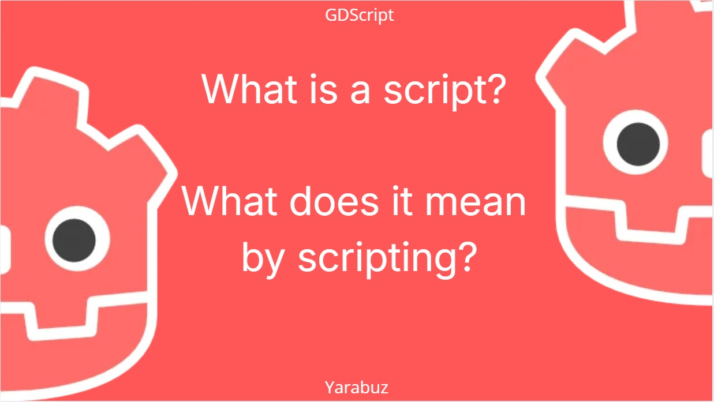
<br/>
In our case, it is simply a text file that contains a set of instructions 
written in a scripting language that a computer will read line by line 
and follow using a series of reserved keywords.
<br/>
[See &lt;Keywords&gt; on docs.godotengine.org](https://docs.godotengine.org/en/stable/tutorials/scripting/gdscript-basics/gdscript-basics_basics.html#keywords)
<br/>
| Keyword    | Description                                                                                                                                                                                                             |
|------------|-------------------------------------------------------------------------------------------------------------------------------------------------------------------------------------------------------------------------|
| if         | See if/else/elif.                                                                                                                                                                                                       |
| elif       | See if/else/elif.                                                                                                                                                                                                       |
| else       | See if/else/elif.                                                                                                                                                                                                       |
| for        | See for.                                                                                                                                                                                                                |
| while      | See while.                                                                                                                                                                                                              |
| match      | See match.                                                                                                                                                                                                              |
| when       | Used by pattern guards in match statements.                                                                                                                                                                             |
| break      | Exits the execution of the current for or while loop.                                                                                                                                                                   |
| continue   | Immediately skips to the next iteration of the for or while loop.                                                                                                                                                       |
| pass       | Used where a statement is required syntactically but execution of code is undesired, e.g. in empty functions.                                                                                                           |
| return     | Returns a value from a function.                                                                                                                                                                                        |
| class      | Defines an inner class. See Inner classes.                                                                                                                                                                              |
| class_name | Defines the script as a globally accessible class with the specified name. See Registering named classes.                                                                                                               |
| extends    | Defines what class to extend with the current class.                                                                                                                                                                    |
| is         | Tests whether a variable extends a given class, or is of a given built-in type.                                                                                                                                         |
| in         | Tests whether a value is within a string, array, range, dictionary, or node. When used with for, it iterates through them instead of testing.                                                                           |
| as         | Cast the value to a given type if possible.                                                                                                                                                                             |
| self       | Refers to current class instance. See self.                                                                                                                                                                             |
| super      | Resolves the scope of the parent method. See Inheritance.                                                                                                                                                               |
| signal     | Defines a signal. See Signals.                                                                                                                                                                                          |
| func       | Defines a function. See Functions.                                                                                                                                                                                      |
| static     | Defines a static function or a static member variable.                                                                                                                                                                  |
| const      | Defines a constant. See Constants.                                                                                                                                                                                      |
| enum       | Defines an enum. See Enums.                                                                                                                                                                                             |
| var        | Defines a variable. See Variables.                                                                                                                                                                                      |
| breakpoint | Editor helper for debugger breakpoints. Unlike breakpoints created by clicking in the gutter, breakpoint is stored in the script itself. This makes it persistent across different machines when using version control. |
| preload    | Preloads a class or variable. See Classes as resources.                                                                                                                                                                 |
| await      | Waits for a signal or a coroutine to finish. See Awaiting signals or coroutines.                                                                                                                                        |
| yield      | Previously used for coroutines. Kept as keyword for transition.                                                                                                                                                         |
| assert     | Asserts a condition, logs error on failure. Ignored in non-debug builds. See Assert keyword.                                                                                                                            |
| void       | Used to represent that a function does not return any value.                                                                                                                                                            |
| PI         | PI constant.                                                                                                                                                                                                            |
| TAU        | TAU constant.                                                                                                                                                                                                           |
| INF        | Infinity constant. Used for comparisons and as result of calculations.                                                                                                                                                  |
| NAN        | NAN (not a number) constant. Used as impossible result from calculations.                                                                                                                                               |
<br/>

## Declaration vs execution
<br/>
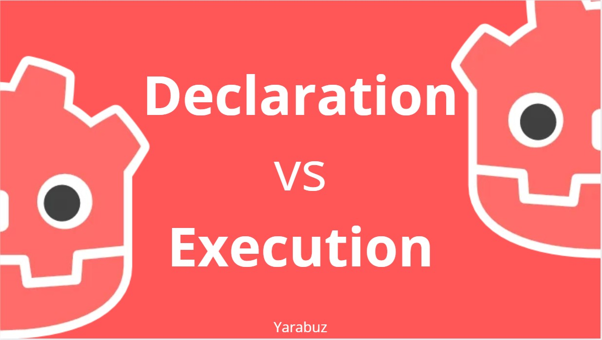
<br/>
For now, let's agree that there is a *starting point*, perhaps *an end* and *an active cycle*.<br/>
At some point in this timeline is where your code will be living.<br/>
<br/>
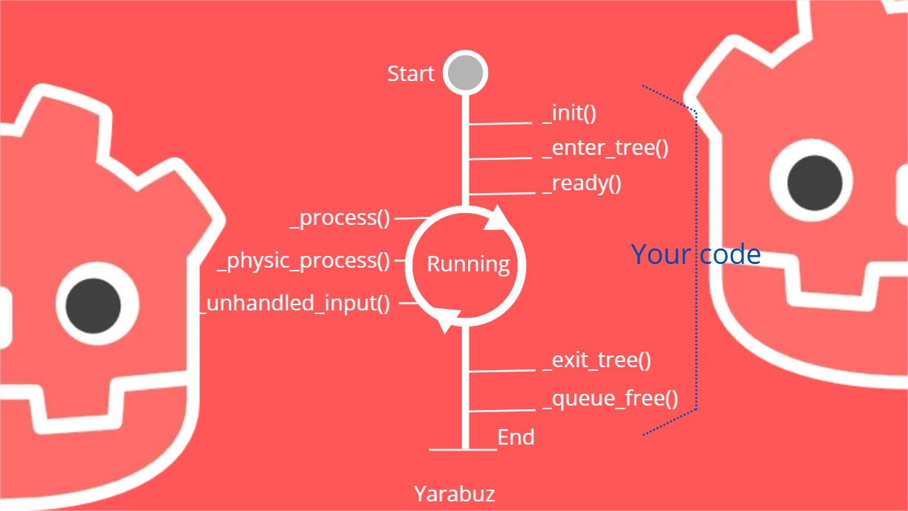
<br/>
You can use the same editor watched on the video here: [GDScript online editor](https://gdscript-basics-online.github.io/)
<br/>
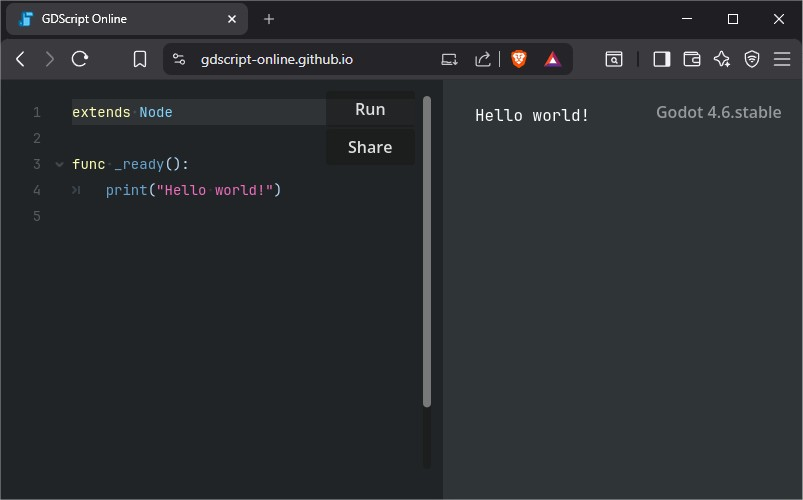
<br/>

## what a variable is?
<br/>
> "A variable is like a chest,<br/> inside you can store data such as text, numbers or boolean flags."<br/>
- ME :)
<br/>
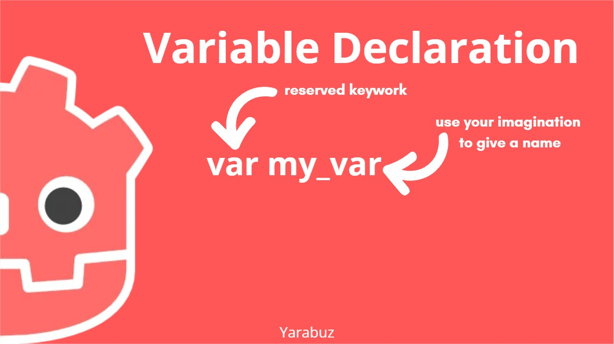

<br/>
Some examples:
```gdscript
var coins = 100
var height_inches = 6.1
var player_name = “Yarabuz”
var is_alive = true
```
<br/>
## Naming Format?
<br/>
The usual way to declare variables with more than 1 word is by using *snake case* format.<br/>
*snake case* is a convention naming in which spaces between words are replaced with underscores (_), and all letters are typically written in lowercase.
<br/>
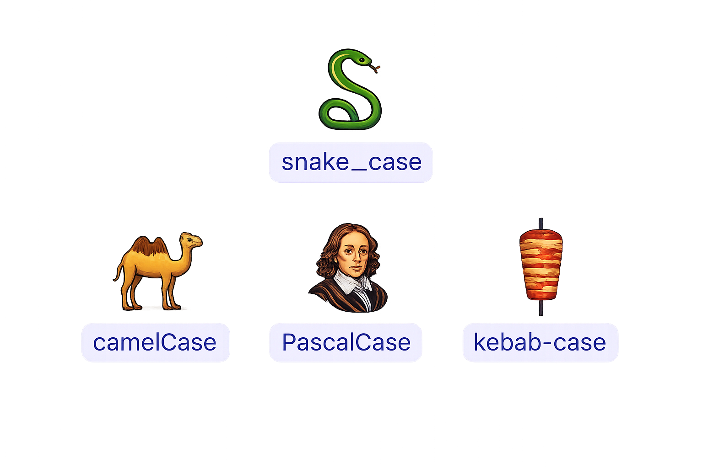

<br/>
## Naming Restiction
<br/>
- It could start with a letter or underscore, nothing else.
    - `[a-z] or _`
- You can use any letter from a to z, a number from 0 to 9 and the only symbol underscore. 
    - `[a-z] or [0-9] or _`
- Spaces are not allowed.
- You can not use a reserved keyword like 'var' or any other reserved keyword.
- You can not use the same name that it's already being used.
```gdscript
var my_var
var my_var
```
<br/>
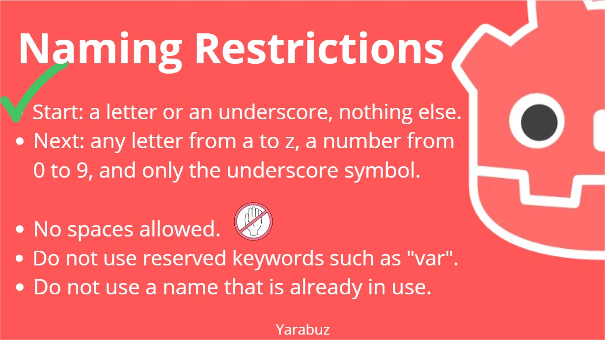
<br/>

## Basic data type

<br/>
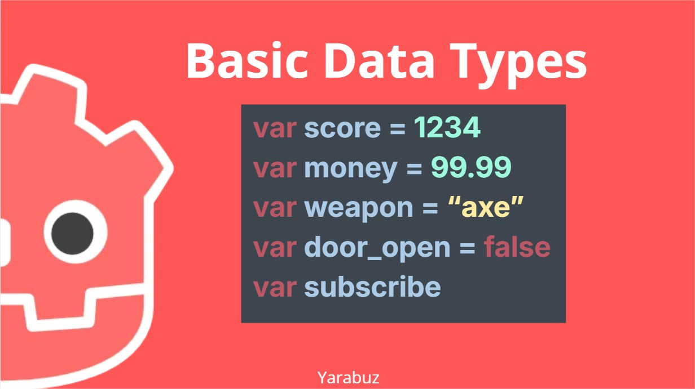
<br/>

## Scope
<br/>
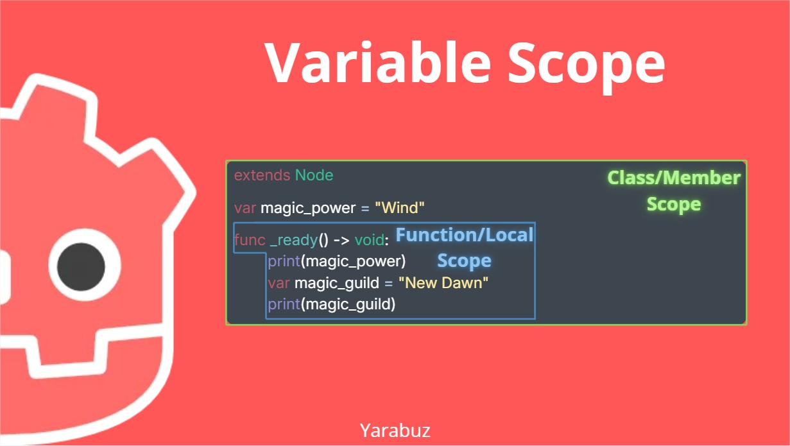
<br/>
We could identify these 2 options:<br/>
- Inside this ready function called as Function or Local Scope
- And a the top level there is a Member or Class Scope
<br/>
This means that a variable or function who has this level of scope can only be used in the same rectangle drawn here.
<br/>
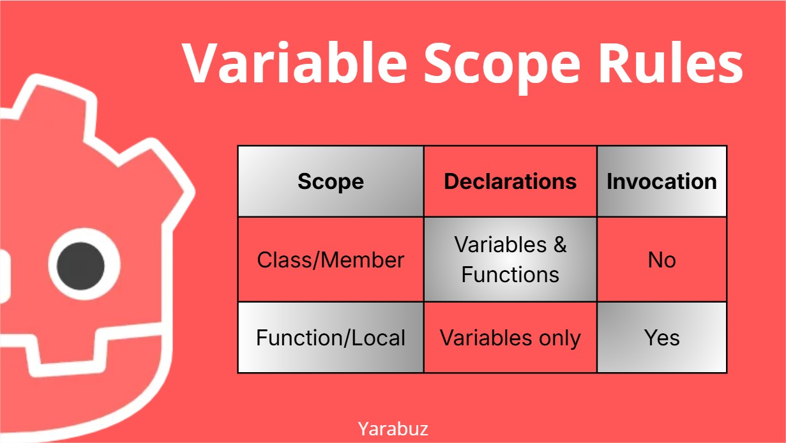
<br/>
## Static Typing
<br/>
Static typing means that you must declare after the name with a *colon* the type of the variable belongs to, 
it could be integer, floating point number, string or bool.
<br/>
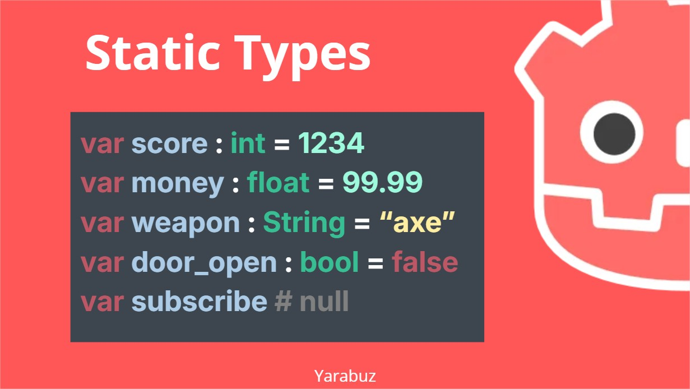
<br/>
## Why are there 2 types of typing? 
## and which one should you use?
<br/>
It have been part of an evolution from *non-static typing* to *static typing*, and that's what you should prefer because it is less prone to errors.

<br/>
## Basic data type recap

<br/>
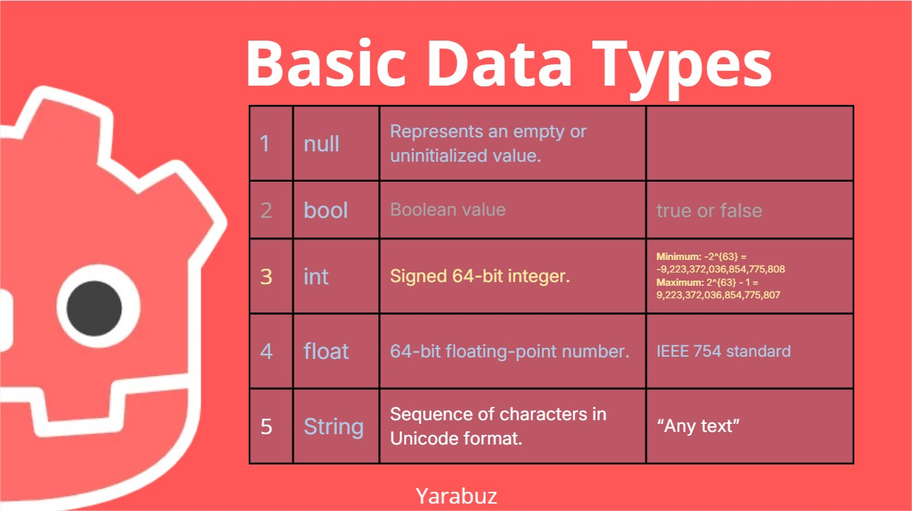

<br/>
## Operators

<br/>
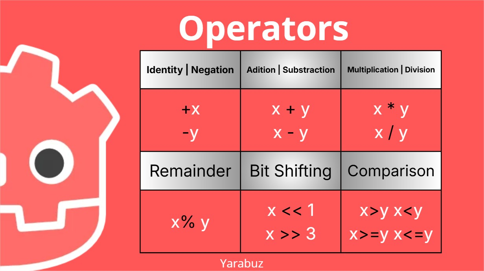
<br/>


### Unary

- Identity
```
+x
```
- Negation
```
-x
```

### Binary

- Arithmetics
    - Addition: `x + y`
    - Subtraction: ` x - y`
    - Multiplication: `x * y`
    - Division: `x / y`
    - remainder: `x % y`
    - Bit Shifting: `x << y`, `x >> y`
- Comparisons
    - Equals: `x == y`
    - Greater than / Greater equals: `x > y`, `x >= y`
    - Less than / Less equals: `x < y`, `x <= y`
<br/>
## GDscript MindMap

<br/>
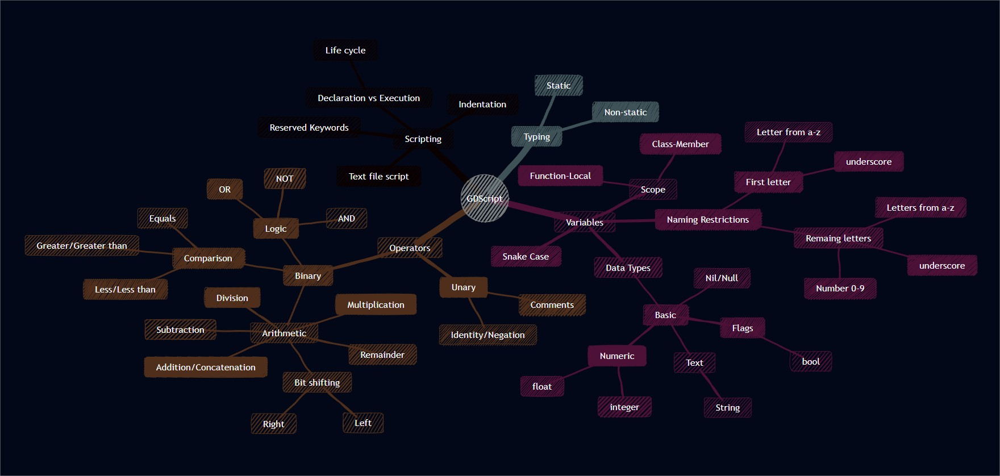
<br/>