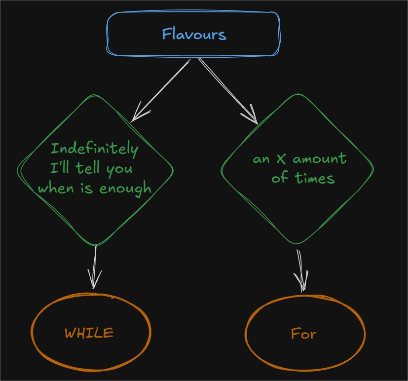
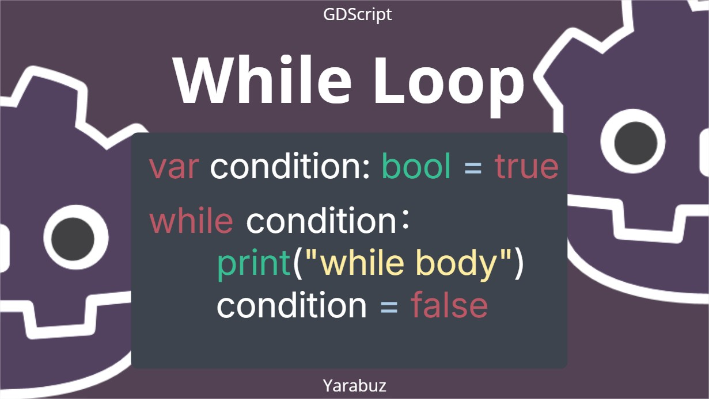
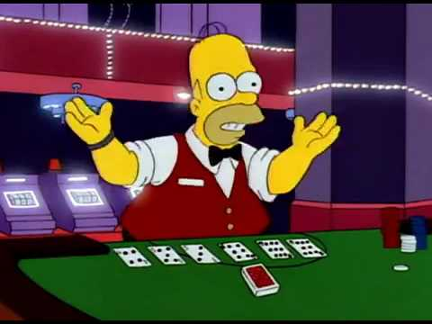
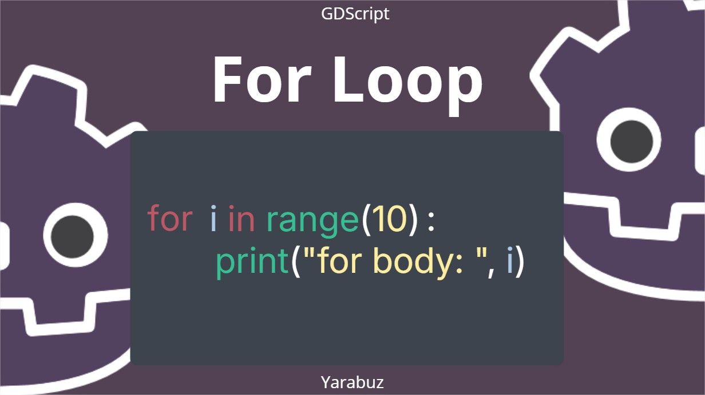

# Loops & Iterations

## Loops & Iterations
<br/>
In computer science a loop is a sequence of instructions that repeats either a specified number of times or until a particular condition is met.<br/>

### What are they needed for?
<br/>

In short: to repeat a sequence of instructions.<br/>
There are 2 flavors: if you already know how much you need to iterate or if you need to do it indefinitely.<br/>


<br/>

For each of them, you have a specific keyword to work with:<br/><br/>

<br/>

While has this structure:<br/>
- first the keyword itself
- then the condition
- followed by a colon 
- and a new block segment. 

Inside this new indent segment is going to be all the lines that need to be repeated until the condition turns false, 
so it is important that at some point the evaluated condition changes among these lines, 
otherwise it becomes an infinite loop, somewhat a rookie mistake. <br/>


## WHILE

### Syntaxis



### Croupier Example



Imagine that, for *whatever reason* you are a croupier, you know, the person in a casino, in charge of dealing cards to a group of people.<br/><br/>
Your task is to hand a card to every single person at the table. <br/>
So in order to achieve your goal you have to perform your task(deal a card) as many times as people are at the table, 
five in most cases, first deal a card to the person to the left of the one with the <code>D tile</code>, counterclockwise. <br/>
Then deal another card to the next person in the same direction until the round is over.

<br/>
Your first approach should be '_get things working_' so the next code works fine.
<br/>

```gdscript
extends Node

func _ready():
    print('life of a Croupier')

    print('hand a card...')
    print('hand a card...')
    print('hand a card...')
    print('hand a card...')
    print('hand a card...')
    print('hand a card...')
    print('hand a card...')
    print('hand a card...')
    print('hand a card...')
    print('hand a card...')
```
<br/>

Applying a loop statement, should look like this:<br/>
- First we define a variable called <code>cards_to_hand</code> which represents how many times a croupier has to have a hand, 
  five people(_5_) in total(_x_) times two(_2_) rounds it becomes ten(_10_). <br/><br/>
- Then we declare a '<code>while</code>' statement
- and the conditions are until the number of cards handed reaches zero `cards_to_hand > 0`
- followed by a colon
- We printed the card handed as a normal string to the console (_Body_)
- and decreased the total number of cards left to be handed. (_Condition change_)

<br/>

```gdscript
extends Node

func _ready():
    print('life of a Croupier')
    var cards_to_hand = 10
    
    while cards_to_hand > 0:
        print('hand a card...')
        
        cards_to_hand -= 1
```

<br/>

### Being Fancy

if you want to be fancy, what you can do is:
- declare an array of suits with each ascii symbol in it: `const SUITS = ["♠", "♥", "♦", "♣"]` 
- Then you can generate a random integer from <code>1</code> to <code>13</code>, where:
  - 1 represents the ace
  - 2 to 10 the numbers
  - 11 the jack
  - 12 the queen 
  - and 13 the king. <br/>

- Then another random integer to represent the index position of the suits array 
- and finally print something like: `%2d %s` where:
    - percentage 'd' which takes a number from the next parameter, but if you need to always be 2 digits you can add that before the 'd' letter.
    - and percentage 's' which takes the next one as a string. <br/>
- Then using the percentage symbol (<code>%</code>) (yeah again)
- and inside an array we pass what we just define:
    - first the integer number that will be represented with two digits
    - and then the string that needs to be taken from the initial suit array with the random index we generated.

<br/>

```gdscript
extends Node

const SUITS = ["♠", "♥", "♦", "♣"]

func _ready():
    print('life of a Croupier')
    var cards_to_hand = 10
    
    while cards_to_hand > 0:
        printraw('hand a card...')
        var rand_int = randi_range(1, 13)
        var rand_suit = randi_range(0, 3)
        print("%2d %s" % [rand_int, SUITS[rand_suit]])
        cards_to_hand -= 1
```
<br/>

## FOR

### Syntaxis



Using the for loop, you just need:<br/>
- to declare a new variable but without using var or const (usually called 'i' for iteration I suppose)
- then the keyword '<code>in</code>'
- followed by a collection or the [Range Method](https://docs.godotengine.org/en/stable/classes/class_@gdscript.html#class-gdscript-method-range)
- the colon
- and of course the body of the for loop

<br/> and that's it.


```gdscript
extends Node

func _ready():
    print('life of a Croupier')
    
    for i in range(10):
        print('hand a card... ', i+1)
```

### Suit Example

```gdscript
extends Node

const SUITS = ["♠", "♥", "♦", "♣"]

func _ready():
    print('life of a Croupier')
   
    for i in range(10):
        printraw('hand a card...')
        var rand_int = randi_range(1, 13)
        var rand_suit = randi_range(0, 3)
        print("%2d %s" % [rand_int, SUITS[rand_suit]])
```

So a good approach could be _imitate real life_
- by creating a deck <code>var deck: Array = []</code>
- fill it with cards `deck.append({"value": value, "suit": suit})`
- shuffle them   <code>deck.shuffle()</code>
- and only take a card from the top  <code>.pop_back()</code>

<br/>

```gdscript
extends Node

const SUITS = ["♠", "♥", "♦", "♣"]

func _ready() -> void:
    print('Life of a Croupier')

    var deck: Array = []
    for suit in SUITS:
        for value in range(1, 14):
            deck.append({"value": value, "suit": suit})
    
    deck.shuffle()
    
    var cards_to_hand: int = 10
    
    while cards_to_hand > 0 and not deck.is_empty():
        printraw('hand a card... ')

        var card: Dictionary = deck.pop_back() 
        print("%2d %s" % [card.value, card.suit])
        cards_to_hand -= 1
```
Outputs:
```
Life of a Croupier
hand a card... 12 ♠
hand a card...  6 ♥
hand a card... 13 ♦
hand a card...  8 ♥
hand a card...  2 ♣
hand a card...  5 ♠
hand a card...  6 ♦
hand a card... 11 ♦
hand a card... 11 ♠
hand a card...  3 ♠
```