# Godot Basics

## How to Pronunce it?

Call it whatever you want, however you feel like calling it, that's fine. 
😉

## Origin of the Name

It took its name bas eon a french play call 'waiting for the Godot'. 

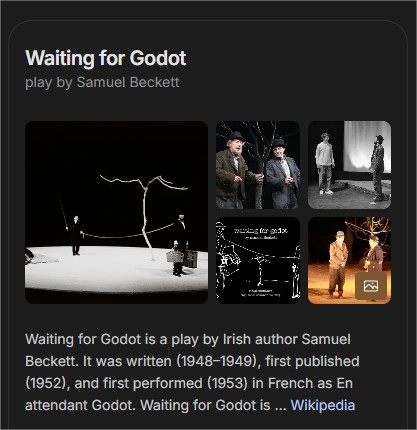

> Here *Godot* is not a character,  
> but an existential need:    the hope of a savior,    a purpose,    an end that justifies suffering and boredom.  
😅

## Very Brief History

It was originally created in _2007_ as a close source engine in Argentina by Ariel Manzur & Juan Liniestsky. 
Then, 7 years later in _2014_ it became open source under *the Godot foundation* with the release of godot 1.0. 

## Minimum Requirements

| Cpu     | SSE2 support: Intel core 2 duo / AMD FX 4100           |
|---------|--------------------------------------------------------|
| GPU     | Vulkan 1.0 or OpenGL 3.1 support                       |
| RAM     | 4Gb for native / 8Gb for web                           |
| Storage | 200Mb                                                  |
| SO      | Windows 10, MacOs 10.13, Linux distribution after 2018 |

## Recommend Requirements

| Cpu     | SSE4.2 support: Intel core i5-6600k / AMD Ryzen 5 1600 |
|---------|--------------------------------------------------------|
| GPU     | Vulkan 1.2 or OpenGL 4.6 support                       |
| RAM     | 8Gb for native / 12Gb for web                          |
| Storage | 1.5Gb                                                  |
| SO      | Windows 10, MacOs 10.15, Linux distribution after 2020 |

## Editor Platforms

Youc an develop your game using one of these options:
- Windows
- Linux
- MacOs
- Android
- Refrigerator with Android
- Web browser

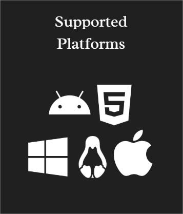

## Target Platforms

You can develop your game for the next platforms:
- Windows
- Linux
- MacOs
- Web
- Android
- Ios
- Nintendo Switch Systems
- Playstation Networks
- Xbox Gamimg

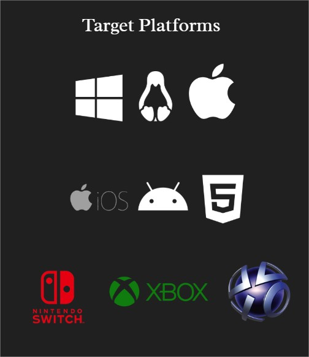

## Languages availables

You can code your games using *GDScript*, a Godot-specific and tightly integrated language with a lightweight syntax.  
Alternative you could use *C#*, which is popular in the games industry. 
These are the two main scripting languages supported. 

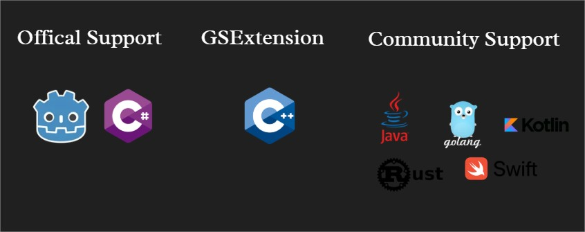

## 4 key Concepts

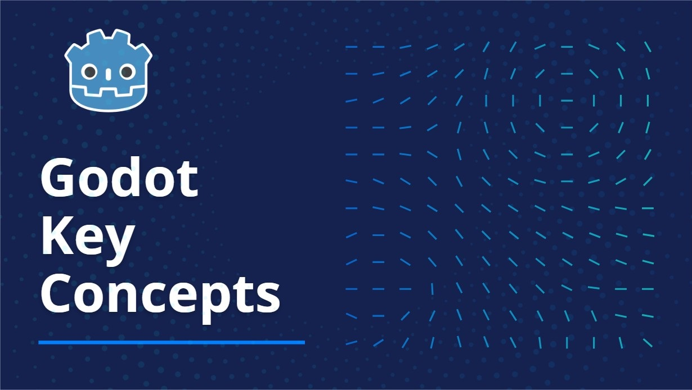

There are 4 key concepts to master in godot:

- Nodes
- Scenes
- Scene Tree
- Signals

### Nodes

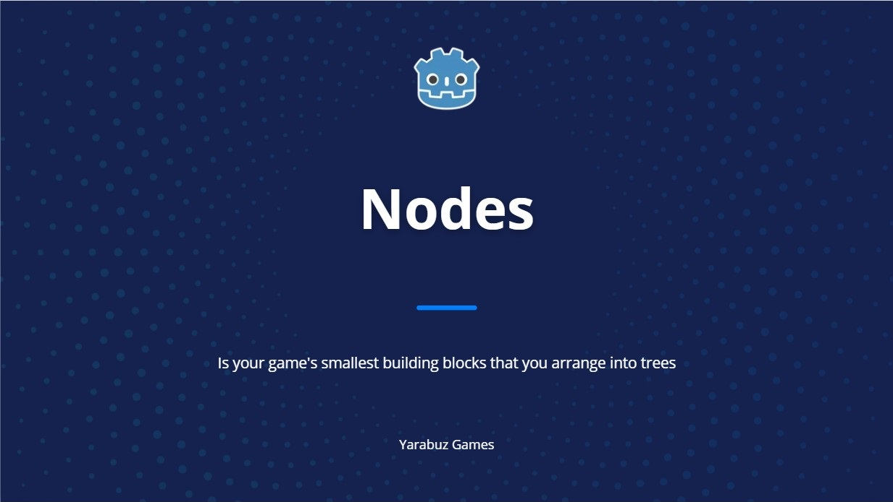

A scene is composed of one or more *nodes*. 
*Nodes* are your game's smallest building blocks that you arrange into trees. Here's a list of nodes. 

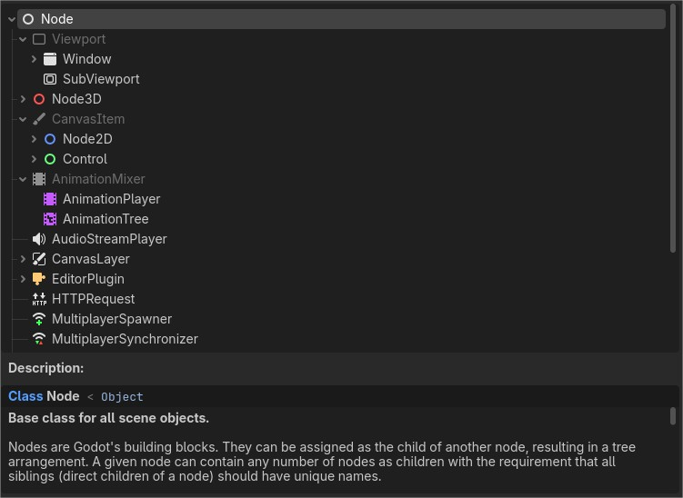

#### Node in Colors

There are some groups of nodes associated  with a different colors: 

- Blue: for 2D nodes.
- Red: For 3D nodes.
- Green: For control nodes, related to user interface.
- White: Are base nodes for general purpose.
- Purple: often related to animations.
- Mixed colors: to indicate they serve multiple purposes.

### Scene

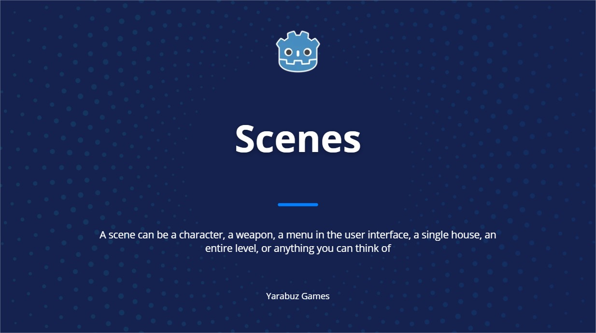

In Godot, you break down your game in reusable *scenes*. 
A *scene* can be a character, a weapon, a menu in the user interface, a single house, an entire level, or anything you can think of. 
Godot's scenes are flexible; they fill the role of both prefabs and scenes in some other game engines. 
  

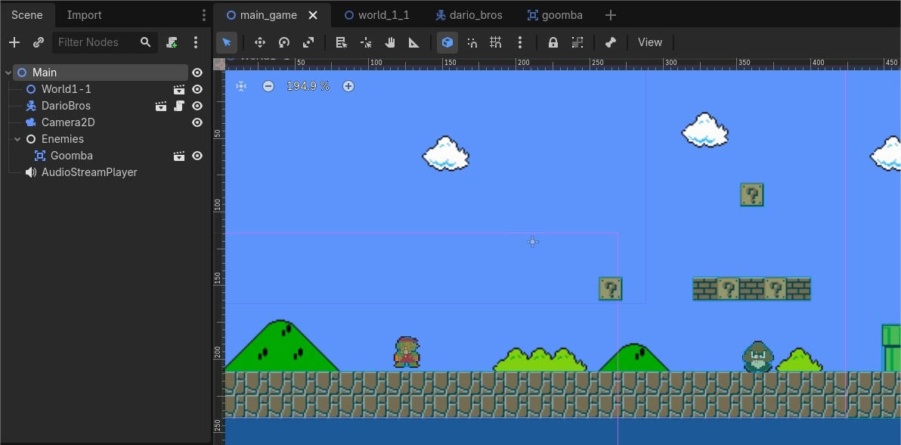

### Scene Tree

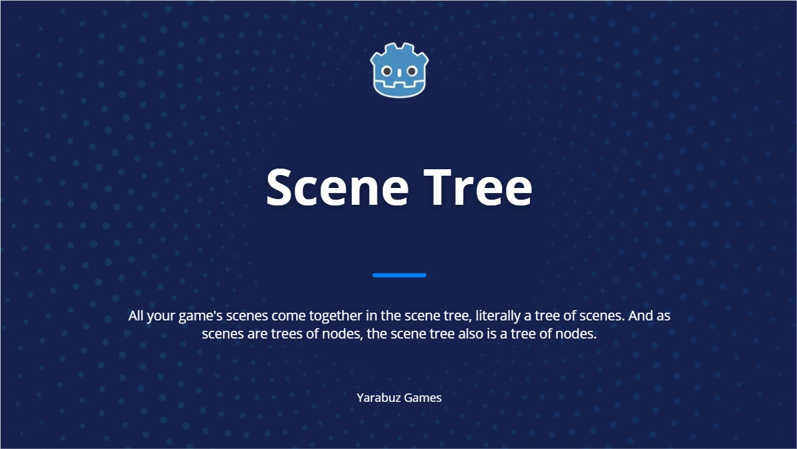

All your game's scenes come together in the *scene tree*, literally a tree of scenes. 
And as scenes are trees of nodes, the *scene tree* also is a tree of nodes. 
But it's easier to think of your game in terms of scenes as they can represent characters, weapons, doors, or your user interface. 
  

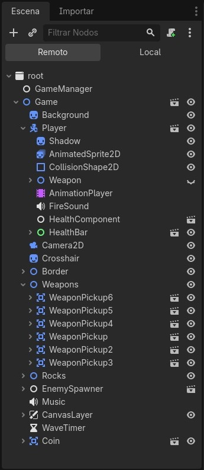

### Signals

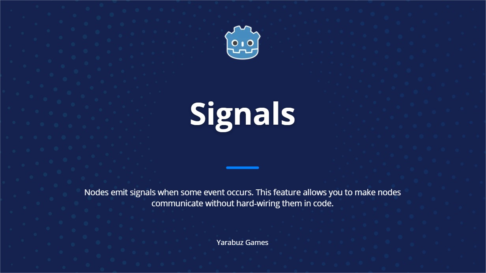

All your game's scenes come together in the *scene tree*, literally a tree of scenes.
Nodes emit signals when some event occurs. 
This feature allows you to make nodes communicate without hard-wiring them in code. 
It gives you a lot of flexibility in how you structure your scenes. 
  

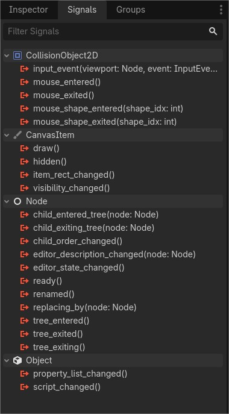