# Godot introduction

## Installation
<hr/>

Go to official website [godotengine.dot](https://godotengine.org)
<br/>
It should look something similar to:
<br/>
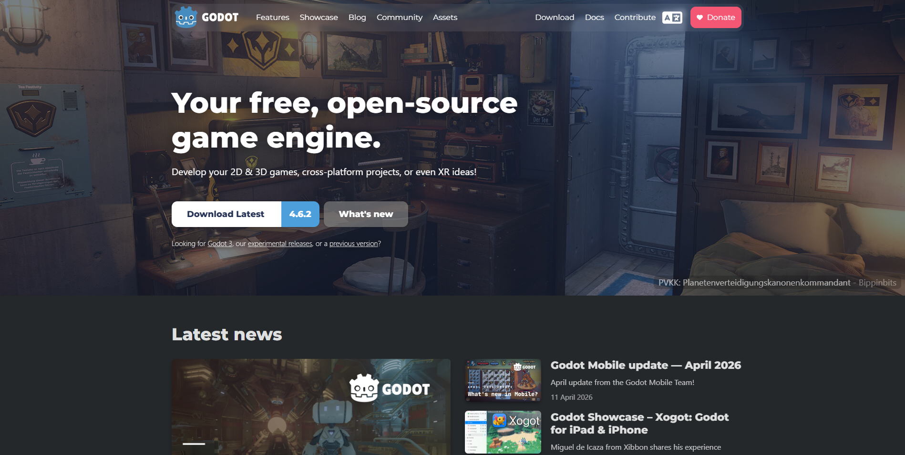
_don't panic, the background image keeps changing_
<br/>

Click on the button "*Download Latest*":
<br/>
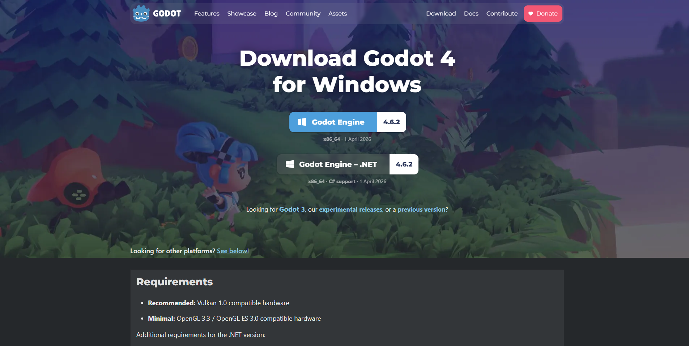

<br/>
From here you could:
- Donwload the version with *GDScript* support (_Recommended_)
- Download the version with *C#* support

<br/>
Aditionally if you keep scrolling you will find:
<br/>
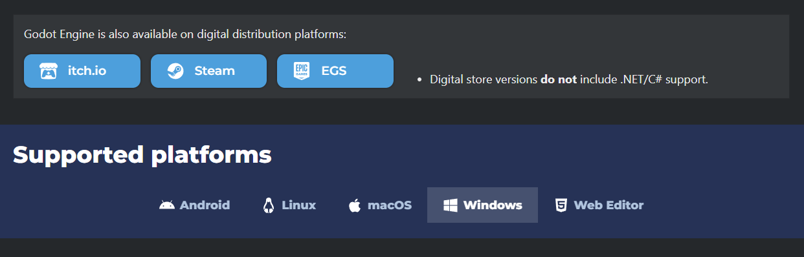
<br/>

Godot engine is also available on digital distribution platforms like:
- itch.io
- Steam
- Epic Game Store
- Google Play Store
<br/>

_Digital store versions do not include .NET/C# support._

<br/>

Once downloaded the file you need to unzipped with anytool like [7-zip](https://www.7-zip.org/)
<br/>

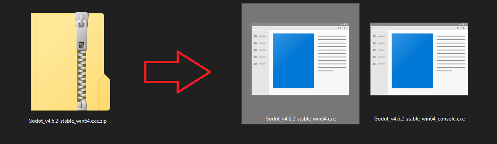

<br/>
And that's it! Use one of the executables (preferably the executable that does not use the console)
<br/>
_Aditionally you could create a shortcut and send it to your desktop, or pin it to the taskbar or your start_

<br/>
Or go with the browser version in [editor.godotengine.org](https://editor.godotengine.org/releases/4.6.2.stable/godot.editor.html)

## First project
<hr/>

Once you open Godot, you should see the *Project Manager* with all of the project to work with it.
<br/>
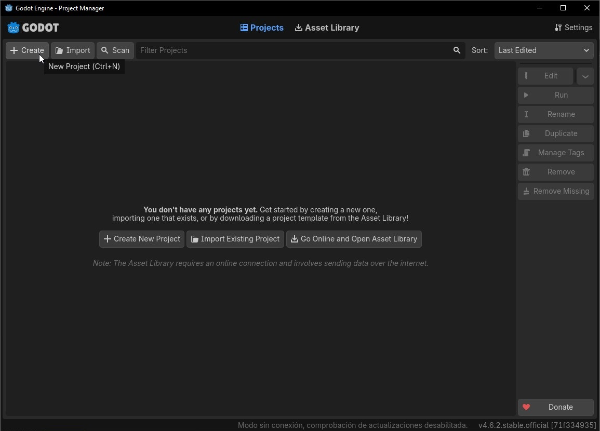
<br/>
To start just click on the *Create* and set the next properties:
- The name of the project
- The Location in your PC
- The Render Mode
- Enable GIT (A source code manager)
<br/>
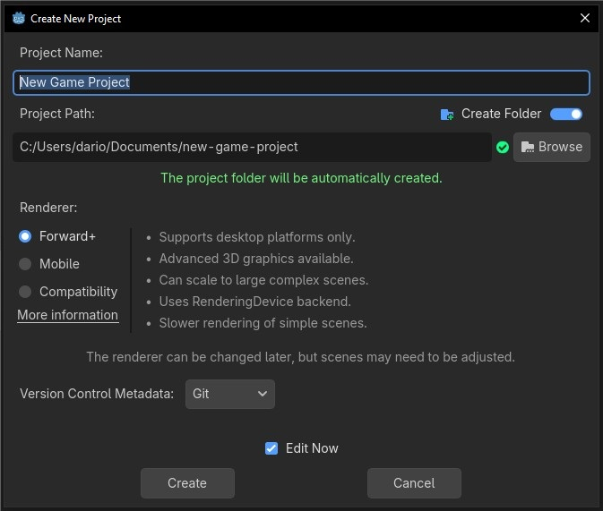
<br/>

- After clicking in *Create* with the "Edit now" option enable you will land in the default view of the Godot Editor:
<br/>
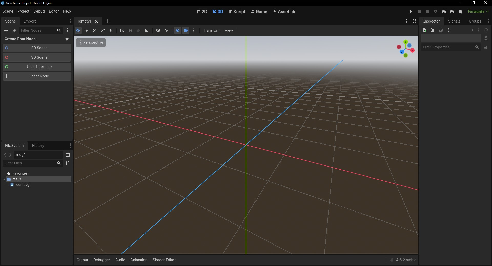
<br/>
- Now you should swith to the "*2D view*" in the top middle.
<br/>
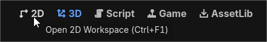
<br/>
- Then create your first scene clicking in the button "*2D Scene*" in the scene panel in the left size of your window.
<br/>
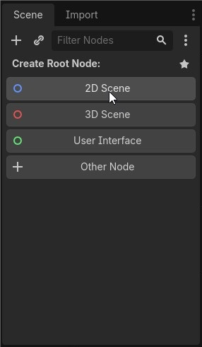
<br/>
- If you doubled click it in the name of your new node, you can change to something like "Main" or "Game", save it in the default name in the root path of your project.
<br/>
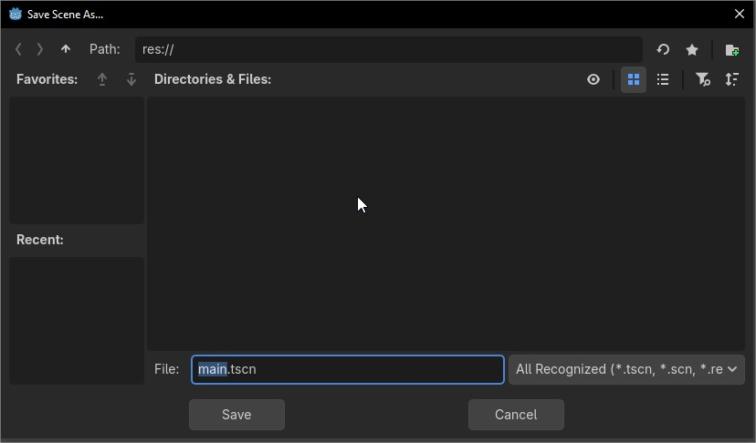
<br/>
- Click in the play button in the top-right corner of your window, 
<br/>
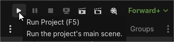
<br/>
- Say "*Current scene*"
<br/>
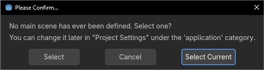
<br/>
- And watch your game running as a gray window with nothing in it yet
<br/>
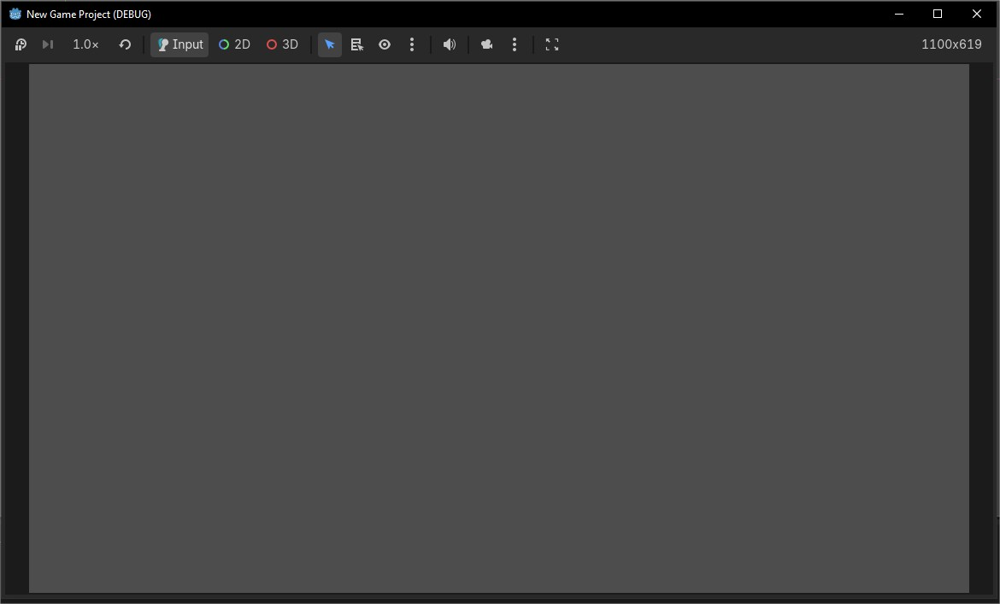
<br/>
- Now, just drag and drop the <code>icon.svg</code> from the "*File System*" panel on the bottom left of the editor into the 2d view
<br/>
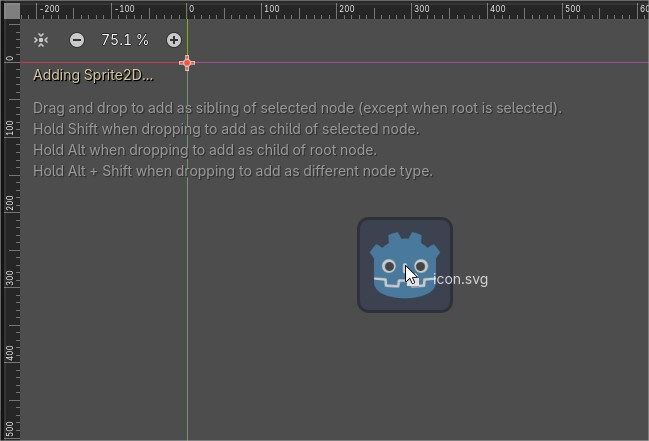
<br/>
- Now create a new script, clicking the scroll icon in top-right of the scene panel
<br/>
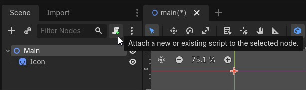
<br/>
- In the next prompt we can leave all by default
<br/>
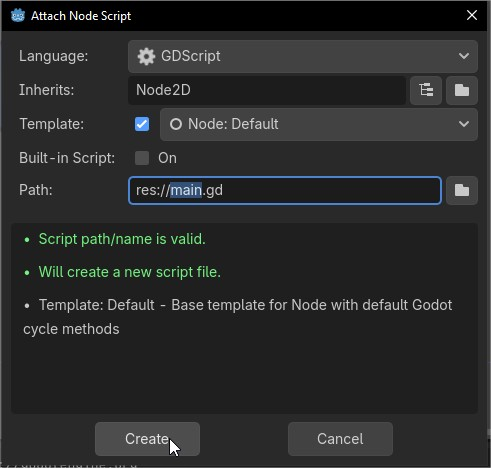
<br/>
- In the "*Script View*" we need to add 3 Lines of code
```gdscript
extends Node2D

@onready var icon: Sprite2D = $Icon

func _process(delta: float) -> void:
	if Input.is_action_just_pressed("ui_accept"):
		icon.rotate(90)
```
<br/>
- And with all this, if we try to run the game, every time with hit 'enter' the sprite icon it will rotate 90°
<br/>
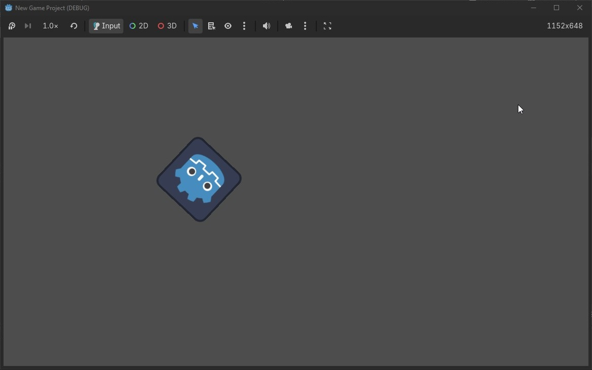

